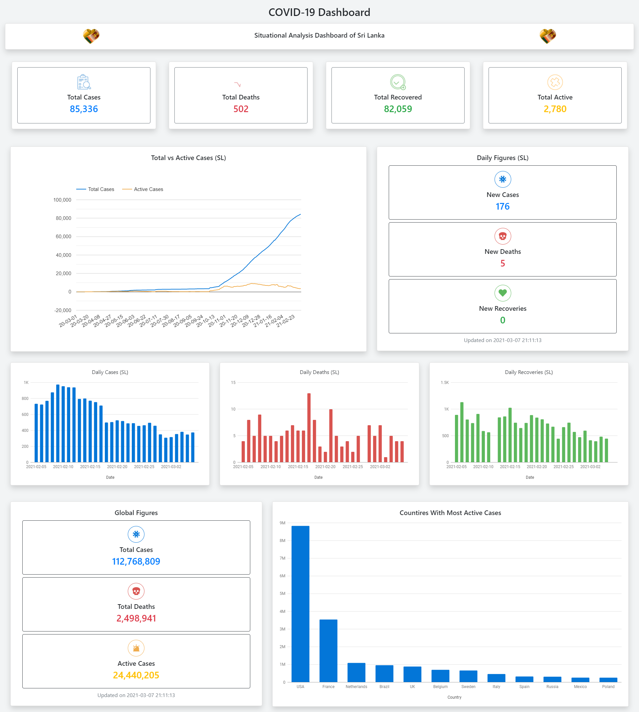

# COVID-19 Dashboard

This a COVID-19 Situational Analysis Dashboard for Sri Lanka developed using ReactJs.You can visit the dashboard from [here](http://covid-19-dashboard-sl.herokuapp.com/).

To obtain data following APIs were used 
- [Covid-19 API](https://hpb.health.gov.lk/en/api-documentation) of the Health Promotion Bureau of Sri Lanka
- [Novel Covid API](https://documenter.getpostman.com/view/8854915/SzS7R6uu?version=latest)

### Screenshots

 

### JS Libraries Used

- `react`
- `redux`
- `redux-thunk`
- `react-redux`
- `axios`
- `react-google-charts` 
- `react-awesome-reveal`
- `react-dom`
- `react-icons`
- `react-loader-spinner`
- `react-scripts`
- `web-vitals`

### Setup guide to run locally

1. First clone this project directory.
    ```bash
    git clone https://github.com/Avishka-Shamendra/covid19-dashboard
    ```
2. If not already installed install [node.js](https://nodejs.org/en/) and [npm](https://www.npmjs.com/get-npm)

3. Open the terminal from the cloned folder and run `npm install` and wait for downloads to finish.
    
4. Then run `npm start` and visit <http://localhost:3000/> to confirm that the app is running.


*Please note that this is a hobby project and that data represented here may not be the true values.*


